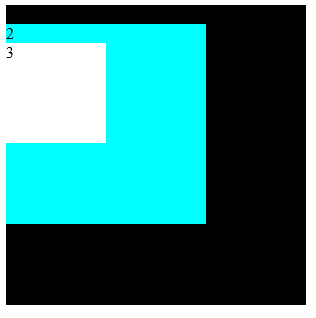

# JavaScript

## ✔ 基本数据类型

- `Boolean`
- `Number`
- `String`
- `Null`
- `Undefined`
- `Object`
- `Symbol`
- `BigInt`

## ✔ 原始值和引用值

**原始值**即一些代表原始数据类型的值，也叫基本数据类型。这些基本数据类型的访问是按值进行访问的。他们被存储在栈中。包括：

- `Number`
- `String`
- `Boolean`
- `Null`
- `Undefined`
- `Symbol`

**引用值**是把引用变量的**名称存储在栈**中，但是把其**实际对象存在堆**中，且存在一个指针由变量名指向存储在堆中的实际对象，当把引用对象传递给另一个变量时，复制的其实是指向实际对象的指针。包括：

- `Object`
- `Function`
- `Array`
- `Date`
- `RegExp`

## ✔ typeof

下表总结了 `typeof` 可能的返回值。

| 类型            | 结果        |
| :-------------- | :---------- |
| `Boolean`       | `boolean`   |
| `Number`        | `number`    |
| `String`        | `string`    |
| `Null`          | `object`    |
| `Undefined`     | `undefined` |
| `Symbol`        | `symbol`    |
| `Function` 对象 | `function`  |
| `BigInt`        | `bigint`    |
| 其他任何对象    | `object`    |

```javascript
typeof NaN // number
typeof 42n // bigint
typeof Symbol('foo') // symbol
typeof [1, 2, 4] // object
typeof new Date() // object
typeof /regex/ // object
typeof new Boolean(true) // object
typeof new String('abc') // object
typeof function() {} // function
typeof new Function() // function
typeof class C {} // function

const f = () => {}
typeof f // function
```

`typeof null === 'object'` 的原因：在 JavaScript 最初的实现中，JavaScript 中的值是由**一个表示类型的标签和实际数据值表示的**。对象的类型标签是 **0**。由于 `null` 代表的是**空指针**（大多数平台下值为 `0x00`），因此，`null` 的类型标签是 `0`，`typeof null` 也因此返回 `object`。

## ✔ `valueOf` 和 `toString`

## ES7、8、9、10 新特性


## 箭头函数

## class

## 作用域和作用域链

## JS 执行上下文

ref

- [https://segmentfault.com/a/1190000005654451](https://segmentfault.com/a/1190000005654451)

## 原型链

## 变量查找原理

## 作用域提升

## this 原理

## 闭包原理及其危害

## 多种继承及其优缺点

## async、await 及 generator、promise 的关系

## JS 协程及 async、await

## Proxy

## forin、forof、for、while、reduce、forEach、map 性能对比

## JS GC 原理

ref

- [https://github.com/lxfriday/give-me-job/issues/61](https://github.com/lxfriday/give-me-job/issues/61)

## `use strict` 使用前后的差别

## 浮点数运算不准确

ref

- [https://juejin.im/post/5dab6dd7e51d457805049b18](https://juejin.im/post/5dab6dd7e51d457805049b18)

## 事件循环

ref

- https://juejin.im/post/5d81bc016fb9a06b084d2acc

+async await

## 节流防抖

ref

- [https://juejin.im/post/5d88d68ae51d4561c541a796](https://juejin.im/post/5d88d68ae51d4561c541a796)

## 正则表达式（regexp.exec）

## flatten 递归把数组扁平化

## reduce((prev, curr) => xx)

## setTimeout、setInterval

## requestIdleCallback

## JS 动画

### requestAnimationFrame

- [https://developer.mozilla.org/zh-CN/docs/Web/API/Window/requestAnimationFrame](https://developer.mozilla.org/zh-CN/docs/Web/API/Window/requestAnimationFrame)

## 函数式编程

# BOM

## WebSocket

## ✔ XMLHttpRequest

### ✔ readyState

`readyState` 共有 5 种状态

| 值  | 状态               | 描述                                             |
| :-- | :----------------- | :----------------------------------------------- |
| 0   | `UNSENT`           | `xhr` 被创建，但没有调用`open()` 方法            |
| 1   | `OPENED`           | `open()`方法已经被调用                           |
| 2   | `HEADERS_RECEIVED` | `send()`方法已经被调用，并且头部和状态已经可获得 |
| 3   | `LOADING`          | 下载中， `responseText` 属性已经包含部分数据     |
| 4   | `DONE`             | 下载操作已完成                                   |

```javascript
const codeMap = {
  0: 'UNSENT',
  1: 'OPENED',
  2: 'HEADERS_RECEIVED',
  3: 'LOADING',
  4: 'DONE',
}
const xhr = new XMLHttpRequest()
console.log('1', codeMap[xhr.readyState])
xhr.open('GET', '/', true)
console.log('2', codeMap[xhr.readyState])
xhr.setRequestHeader('accept', 'text/html')
xhr.responseType = 'text'
xhr.onprogress = function() {
  console.log('onprogress', codeMap[xhr.readyState])
  // console.log('responseText', xhr.responseText) // 已经有部分 response
}
xhr.onload = function() {
  console.log('onload', codeMap[xhr.readyState])
}
xhr.onreadystatechange = function() {
  console.log('onreadystatechange', codeMap[xhr.readyState])
}
xhr.send()
console.log('3', codeMap[xhr.readyState])
```

会打印下面的内容

```
1 UNSENT
2 OPENED
3 OPENED
onreadystatechange HEADERS_RECEIVED
onreadystatechange LOADING
onprogress LOADING
onreadystatechange LOADING
onprogress LOADING
onreadystatechange DONE
onload DONE
```

### ✔ responseType

`xhr.responseType` 用来指定 `xhr.response` 的类型。

| 值               | `xhr.response`数据类型 | 说明                                                            |
| :--------------- | :--------------------- | :-------------------------------------------------------------- |
| 空字符串或者不设 | 字符串                 | 将 `responseType` 设为空字符串与设置为`"text"`相同， 是默认类型 |
| `text`           | 字符串                 |                                                                 |
| `document`       | `Document` 对象        | 希望返回 XML 格式数据时使用                                     |
| `json`           | JSON                   |                                                                 |
| `blob`           | `Blob` 对象            |                                                                 |
| `arraybuffer`    | `ArrayBuffer` 对象     |                                                                 |
|                  |                        |                                                                 |

### ✔ 事件

ref [https://segmentfault.com/a/1190000004322487](https://segmentfault.com/a/1190000004322487)

| 事件                 | 触发条件                                                                                                                                                                                                                                                                                                                                                                                                                      |
| :------------------- | :---------------------------------------------------------------------------------------------------------------------------------------------------------------------------------------------------------------------------------------------------------------------------------------------------------------------------------------------------------------------------------------------------------------------------- |
| `onreadystatechange` | 每当 `xhr.readyState` 改变时触发                                                                                                                                                                                                                                                                                                                                                                                              |
| `onloadstart`        | 调用 `xhr.send()`方法后立即触发，若 `xhr.send()`未被调用则不会触发此事件。此时 `readyState` 为 1(`OPENED`)                                                                                                                                                                                                                                                                                                                    |
| `onprogress`         | `xhr.upload.onprogress` 在上传阶段(即 `xhr.send()`之后，`xhr.readystate=2` 之前)触发，每 50ms 触发一次；`xhr.onprogress` 在下载阶段（即 `xhr.readystate=3` 时）触发，每 50ms 触发一次。                                                                                                                                                                                                                                       |
| `onload`             | 当请求成功完成时触发，此时 `xhr.readystate=4`                                                                                                                                                                                                                                                                                                                                                                                 |
| `onloadend`          | 当请求结束（包括请求成功和请求失败）时触发                                                                                                                                                                                                                                                                                                                                                                                    |
| `onabort`            | 当调用 `xhr.abort()` 后触发                                                                                                                                                                                                                                                                                                                                                                                                   |
| `ontimeout`          | `xhr.timeout` 不等于 0，由请求开始即 `onloadstart` 开始算起，当到达 `xhr.timeout` 所设置时间请求还未结束即 `onloadend`，则触发此事件。                                                                                                                                                                                                                                                                                        |
| `onerror`            | 在请求过程中，若发生 `Network error` 则会触发此事件（若发生 `Network error` 时，上传还没有结束，则会先触发 `xhr.upload.onerror`，再触发`xhr.onerror`；若发生 `Network error` 时，上传已经结束，则只会触发 `xhr.onerror`）。注意，只有发生了网络层级别的异常才会触发此事件，对于应用层级别的异常，如响应返回的 `xhr.statusCode` 是 `4xx` 时，并不属于 `Network error`，所以不会触发 `onerror` 事件，而是会触发 `onload` 事件。 |

## encodeURIComponent 和 encodeURI

# DOM

## DOM 操作(增删改查)

## DOM 属性

## ✔ 事件冒泡、捕捉、代理

### ✔ 事件模型

ref

- [https://www.quirksmode.org/js/events_order.html](https://www.quirksmode.org/js/events_order.html)

事件捕捉（源自 Netscape）

```
               | |
---------------| |-----------------
| element1     | |                |
|   -----------| |-----------     |
|   |element2  \ /          |     |
|   -------------------------     |
|        Event CAPTURING          |
-----------------------------------
```

事件冒泡（源自 Microsoft ）

```
               / \
---------------| |-----------------
| element1     | |                |
|   -----------| |-----------     |
|   |element2  | |          |     |
|   -------------------------     |
|        Event BUBBLING           |
-----------------------------------
```

W3C 事件模型（先捕捉再冒泡）

```
                 | |  / \
-----------------| |--| |-----------------
| element1       | |  | |                |
|   -------------| |--| |-----------     |
|   |element2    \ /  | |          |     |
|   --------------------------------     |
|        W3C event model                 |
------------------------------------------
```

### ✔ addEventListener

用法

```js
target.addEventListener(type, listener, options)
target.addEventListener(type, listener, useCapture)
```

- `type` 表示监听事件类型的字符串；
- `listener` 当所监听的事件类型触发时，会接收到一个事件通知（实现了 [Event](https://developer.mozilla.org/zh-CN/docs/Web/API/Event) 接口的对象）对象；
- `options` 一个指定有关 `listener` 属性的可选参数对象；
  - `capture` (`Boolean`)：是否在捕获阶段触发；
  - `once`(`Boolean`)：是否只调用一次，为 `true` 则在事件调用一次之后会被移除；
  - `passive` (`Boolean`)：设置为 `true` 时，表示 `listener` 永远不会调用 `preventDefault()`。如果 `listener` 仍然调用了这个函数，客户端将会忽略它并抛出一个控制台警告；
- `useCapture`(`Boolean`)：默认为 `false` 表示在冒泡阶段调用，为 `true` 表示在捕获阶段调用；

`addEventListener` 相比 `onXX` ，前者可以对同一事件注册多个监听函数，也可以指定冒泡或者捕获。`addEventListener` 对同一个函数引用无论注册多少次，都只会相当于注册一次，对不同函数引用则会全部注册。

```javascript
box3.addEventListener('click', function(e) {
  console.log('box3')
})
box3.addEventListener('click', function(e) {
  console.log('box3')
})
box3.addEventListener('click', function(e) {
  console.log('box3')
})
// 点击一次 box3，打印三次 box3
```

```javascript
function b3(e) {
  console.log('box3')
}
box3.addEventListener('click', b3)
box3.addEventListener('click', b3)
box3.addEventListener('click', b3)
// 点击一次 box3，打印一次 box3
```



```html
<style>
  .box1 {
    width: 300px;
    height: 300px;
    background-color: black;
  }
  .box2 {
    width: 200px;
    height: 200px;
    background-color: cyan;
  }
  .box3 {
    width: 100px;
    height: 100px;
    background-color: white;
  }
</style>

<body>
  <div class="box1">
    1
    <div class="box2">
      2
      <div class="box3">3</div>
    </div>
  </div>
  <script>
    const box1 = document.querySelector('.box1')
    const box2 = document.querySelector('.box2')
    const box3 = document.querySelector('.box3')
  </script>
</body>
```

**冒泡**

```javascript
box1.addEventListener('click', function(e) {
  console.log('box1')
})
box2.addEventListener('click', function(e) {
  console.log('box2')
})
box3.addEventListener('click', function(e) {
  console.log('box3')
})
// 点击 `.box3` 所在的区域时
// box3
// box2
// box1
```

**捕捉**

```javascript
box1.addEventListener(
  'click',
  function(e) {
    console.log('box1')
  },
  true
)
box2.addEventListener(
  'click',
  function(e) {
    console.log('box2')
  },
  true
)
box3.addEventListener(
  'click',
  function(e) {
    console.log('box3')
  },
  true
)
// 点击 `.box3` 所在的区域时
// box1
// box2
// box3
```

**捕捉和冒泡混合**

```javascript
box1.addEventListener(
  'click',
  function(e) {
    console.log('box1')
  },
  true
)
box2.addEventListener('click', function(e) {
  console.log('box2')
})
box3.addEventListener('click', function(e) {
  console.log('box3')
})
// 点击 `.box3` 所在的区域时
// box1
// box3
// box2
```

**在同一个目标元素（捕捉和冒泡切换的末端）上注册了冒泡和捕捉两种事件时，先注册的事件先执行**

```javascript
box1.addEventListener('click', function(e) {
  console.log('box1')
})
box2.addEventListener('click', function(e) {
  console.log('box2')
})
box3.addEventListener(
  'click',
  function(e) {
    console.log('box3 capture')
  },
  true
)
box3.addEventListener('click', function(e) {
  console.log('box3 bubble')
})
// 点击 `.box3` 所在的区域时
// box3 capture
// box3 bubble
// box2
// box1
```

```javascript
box1.addEventListener('click', function(e) {
  console.log('box1')
})
box2.addEventListener('click', function(e) {
  console.log('box2')
})
box3.addEventListener('click', function(e) {
  console.log('box3 bubble')
})
box3.addEventListener(
  'click',
  function(e) {
    console.log('box3 capture')
  },
  true
)
// 点击 `.box3` 所在的区域时
// box3 bubble
// box3 capture
// box2
// box1
```

### ✔ attachEvent

对于 Internet Explorer 来说，在 IE 9 之前，你必须使用 `attachEvent` 而不是使用标准方法 `addEventListener`。

可以使用 `window.event.srcElement` 或者 `e.srcElement` 获取触发事件的元素（是点击时的元素，不一定是绑定事件的元素）。

`attachEvent` 时间处理函数中的 `this` 对应的是 `window`，不是绑定该事件的元素。

```javascript
box1.attachEvent('onclick', function(e) {
  console.log('box1')
  console.log(window.event.srcElement)
  console.log(e.srcElement)
})
```

### ✔ 禁止冒泡、捕捉

在事件监听函数中执行 `e.stopPropagation()`

```javascript
box3.addEventListener('click', function(e) {
  e.stopPropagation()
})
```

### ✔ 获取触发事件的元素

ref

- [https://www.quirksmode.org/js/events_order.html](https://www.quirksmode.org/js/events_order.html)

1. `e.target` 或者 `e.srcElement` 获取到触发事件的元素，它不会变；
1. `e.currentTarget` 获取到处理当前事件的目标对象，它是变化的；
1. `this` 获取绑定该事件的元素；

如果几个不同的元素绑定相同的时间处理函数，当使用 `e.target` 或者 `e.srcElement` 获取目标对象时永远获取的都是那个触发事件的元素。

```javascript
// 点击 box3
box1.addEventListener('click', function(e) {
  console.log('box1 e.target', e.target)
})
box2.addEventListener('click', function(e) {
  console.log('box2 e.target', e.target)
})
```


```javascript
// 点击 box3
box1.addEventListener('click', function(e) {
  console.log('box1 this', this)
})
box2.addEventListener('click', function(e) {
  console.log('box2 this', this)
})
```


### ✔ 事件代理

事件代理是利用事件的冒泡、捕捉机制，让绑定事件更加统一的一种方式。

当我们有一个 `ul`，想在其中动态的增删 `li` 时，事件代理就非常适合在这里使用。

```html
<ul>
  <li key="1" name="lx">11</li>
  <li key="2">22</li>
  <li key="3">33</li>
  <li key="4">44</li>
</ul>

<script>
  ul.addEventListener('click', function(e) {
    console.log('target', e.target) // li
    console.log('key', e.target.attributes.key.value)
  })
</script>
```

我们删除了 `li` 时无需删除事件绑定，也无需为新增的 `li` 绑定事件。点击事件会冒泡到 `ul` 并被这个事件处理程序处理，我们只需要拿到当前点击的元素 `e.taregt` 做对应的处理即可。

## `document.querySelectorXX` 和 `document.getElementByXX` 的区别

## Cookie

## Session

## localStorage

## sessionStorage

### 增删改查

ref

- [https://www.w3school.com.cn/js/js_cookies.asp](https://www.w3school.com.cn/js/js_cookies.asp)

### 不同二级域名共享 cookie

# V8 专区

## JS 内存泄露

## JS 编译器及解释器

# NodeJS

## commonJS 和 ESM 差异

## EventEmmiter 实现

## Koa

### 洋葱模型

## restful API 介绍及其优缺点

# CSS

## 伪类

## ✔ 伪类优先级(lvha)

default < `:link` < `:visited` < `:hover` < `:active`

```css
.link {
  color: red;
}
.link:link {
  color: green;
}
.link:visited {
  color: cyan;
}
.link:hover {
  color: yellow;
}
.link:active {
  color: white;
}
```

## 伪元素

## CSS 盒模型

## CSS 写画一个三角形

## 基本布局

## ✔ 垂直居中

ref

- [https://juejin.im/post/5b9a4477f265da0ad82bf921](https://juejin.im/post/5b9a4477f265da0ad82bf921)

仅居中定宽高元素适用：

- absolute + 负 margin
- absolute + margin auto
- absolute + calc

居中不定宽高元素：

- absolute + transform
- css-table
- flex
- grid

公共代码

```html
<style>
  /* 公共代码 */
  .wp {
    border: 1px solid red;
    width: 300px;
    height: 300px;
  }

  .box {
    background: green;
  }

  .box.size {
    width: 100px;
    height: 100px;
  }
  /* 公共代码 */
</style>

<div class="wp">
  <div class="box size">123123</div>
</div>
```

### ✔ absolute + 负 margin

必须知道 `.box` 宽高。

```css
.box {
  background: green;
  position: absolute;
  top: 50%;
  left: 50%;
  margin-left: -50px;
  margin-top: -50px;
}
```

### ✔ absolute + margin auto

必须知道 `.box` 宽高

```css
.box {
  background: green;
  position: absolute;
  top: 0;
  left: 0;
  right: 0;
  bottom: 0;
  margin: auto;
}
```

### ✔ absolute + calc

需要知道 `.box` 宽高，需要考虑 `calc` 的兼容性，`calc(50% - 50px);` 中 `-` 前后的空格不能省略。

```css
.box {
  background: green;
  position: absolute;
  top: calc(50% - 50px);
  left: calc(50% - 50px);
}
```

### ✔ absolute + transform

`transform` 的 `translate` 使用百分比时是相对当前的元素，所以不需要知道当前元素的大小。

```css
.box {
  background: green;
  position: absolute;
  top: 50%;
  left: 50%;
  transform: translate(-50%, -50%);
}
```

### ✔ css-table

```css
.wp {
  border: 1px solid red;
  width: 300px;
  height: 300px;
  display: table-cell;
  text-align: center;
  vertical-align: middle;
}

.box {
  background-color: green;
  display: inline-block;
}
```

### ✔ flex

比较主流

```css
.wp {
  border: 1px solid red;
  width: 300px;
  height: 300px;
  display: flex;
  justify-content: center;
  align-items: center;
}
```

### ✔ grid

兼容性比较差

```css
.wp {
  border: 1px solid red;
  width: 300px;
  height: 300px;
  display: grid;
}

.box {
  background-color: green;
  align-self: center;
  justify-self: center;
}
```

## reflow、repaint

## 外边距折叠（BFC）

## 清除浮动

## ✔ CSS 选择器优先级

ref

- [https://juejin.im/post/5dd27cfbf265da0bad797dc6](https://juejin.im/post/5dd27cfbf265da0bad797dc6)

选择器类型：

对优先级无影响的：

1. 通配选择符 (`*`)
1. 关系选择器
   1. `+` 相邻兄弟选择器
   1. `~` 通用兄弟选择器
   1. `>` 子选择器
   1. `' '` 后代选择器
1. 伪元素选择器(`::before`)

对优先级有影响的：

1. `!important`
1. 内联样式
1. id 选择器(`#box`)
1. 伪类选择器(`:hover`)
1. 类选择器(`.container`)
1. 属性选择器(`[name=lxfriday]`)
1. 元素选择器(`h1`)

- `!important` > 内联样式 style > id 选择器 > 伪类选择器 > 属性选择器 = class 选择器 > 元素(类型)选择器；
- 相同的选择器，后面声明的比前面声明的优先级高，相同属性后者覆盖前者；

关系选择器 > 通配符选择器

伪元素的属性部分继承自元素，由于伪元素无法用其他选择器选中，所以不参与优先级排序。

`!important` 如何覆盖：

- 方法 1：内联样式设置了 `!important` ，使用 js(`el.style.color = 'red'`) 可以消除；
- 方法 2：再添加一条带 `!important` 的 CSS 规则，再给这个给选择器更高的优先级（添加一个标签，ID 或类）；
- 方法 3：使用相同的选择器，但是置于已有的样式之后（后者覆盖前者）；

经典题：两个 `div` 内的文字都是 `red`，因为 `.blue` `.red` 优先级相同，后声明的覆盖前者。

```html
<body>
  <style>
    .blue {
      color: blue;
    }
    .red {
      color: red;
    }
  </style>
  <div>
    <div class="blue red">111</div>
    <div class="red blue">111</div>
  </div>
</body>
```

## flex: flex-grow flex-shrink flex-basis

ref

- [https://juejin.im/post/589965c9128fe1006569cc9d#heading-3](https://juejin.im/post/589965c9128fe1006569cc9d#heading-3)

## keyframes

# React

## React Context

## React 事件机制

ref

- [https://juejin.im/post/5c7df2e7f265da2d8a55d49d](https://juejin.im/post/5c7df2e7f265da2d8a55d49d)

## React 事件绑定 this

## React Fiber

ref

- [https://zhuanlan.zhihu.com/p/37095662](https://zhuanlan.zhihu.com/p/37095662)
- [https://juejin.im/post/5dadc6045188255a270a0f85](https://juejin.im/post/5dadc6045188255a270a0f85)

## setState 原理

ref

- [https://juejin.im/post/5b45c57c51882519790c7441](https://juejin.im/post/5b45c57c51882519790c7441)
- [测试 code](https://codesandbox.io/s/modest-volhard-0l3ov?fontsize=14&hidenavigation=1&theme=dark)

## HOC

## HOOKS 原理

## 虚拟 DOM

## React Router 原理

## Redux 原理

## Redux Saga 原理

## immer

## immutable

# Webpack

## Loader 编写

## Plugin 编写

# Axios

## Axios 封装

# HTML

## HTML Element 和 HTML Node

ref

- [https://developer.mozilla.org/zh-CN/docs/Web/API/HTMLElement](https://developer.mozilla.org/zh-CN/docs/Web/API/HTMLElement)
- [https://developer.mozilla.org/zh-CN/docs/Web/API/Node](https://developer.mozilla.org/zh-CN/docs/Web/API/Node)

## `<meta http-equiv="X-UA-Compatible" content="IE=edge,chrome=1" />`

IE8/9 及以后的版本都会以最高版本 IE 来渲染页面，用来指定 IE 浏览器去模拟某个特定版本的 IE 浏览器的渲染方式(如 IE6)，以此来解决部分兼容问题，如果存在 GCF(Google Chrome Frame)则使用 GCF 渲染，否则使用最高版本的 IE 内核进行渲染。

# 协议（HTTP+TCP+UDP）

## ✔ OSI 七层网络分层模型

ref

- [https://baike.baidu.com/item/%E4%B8%83%E5%B1%82%E6%A8%A1%E5%9E%8B/1441391](https://baike.baidu.com/item/%E4%B8%83%E5%B1%82%E6%A8%A1%E5%9E%8B/1441391)
- [https://www.zhihu.com/question/24002080/answer/410983148](https://www.zhihu.com/question/24002080/answer/410983148)

开放式系统互联通信参考模型（Open System Interconnection Reference Model）。

| 名称       | 特征                                                                                                                                        |
| :--------- | :------------------------------------------------------------------------------------------------------------------------------------------ |
| 应用层     | 网络服务与最终用户的一个接口。包含：**HTTP HTTPS DNS TELNET FTP DHCP TFTP SMTP SNMP POP3** 。                                               |
| 表示层     | 提供数据压缩、解压、加密等服务，为应用层提供语法选择，语法转换。                                                                            |
| 会话层     | 建立、管理、终止会话。对应主机进程，指本地主机与远程主机正在进行的会话。                                                                    |
| 传输层     | 定义传输数据的协议端口号，以及流控和差错校验。包括 **TCP，UDP，SPX**。                                                                      |
| 网络层     | 基于 IP 地址为数据的传输进行网络间的路由选择。包括 **ICMP IGMP IP（IPV4 IPV6）**，**路由器**工作在网络层。                                  |
| 数据链路层 | 建立逻辑连接、**进行硬件地址寻址**、差错校验等功能。将比特组合成字节进而组合成帧，用 MAC 地址访问介质，错误发现但不能纠正。包括：**交换机** |
| 物理层     | 为数据传输提供物理媒体，进行数据的实际传输。包含：**网线、光纤**                                                                            |

## ✔ TCP/IP 四层网络分层模型


| 名称                      | 特征                                                                                                                          |
| :------------------------ | :---------------------------------------------------------------------------------------------------------------------------- |
| 应用层(application layer) | 有各种面向具体应用的协议。包含 Telnet、SSH、FTP、SMTP 、HTTP 等等                                                             |
| 传输层(transport layer)   | 保证数据在 IP 地址标记的两点之间“可靠”地传输，是 TCP 协议工作的层次，另外还包括 UDP                                           |
| 网际层(internet layer)    | 包含 IP 协议，可以在链接层的基础上，用 IP 地址取代 MAC 地址，把许许多多的局域网、广域网连接成一个虚拟的巨大网络               |
| 链接层(link layer)        | 负责在以太网、WiFi 这样的底层网络上发送原始数据包，工作在网卡这个层次，使用 MAC 地址来标记网络上的设备，所以有时候也叫 MAC 层 |

链接层的传输单位是帧（frame），IP 层的传输单位是包（packet），TCP 层的传输单位是段（segment），HTTP 的传输单位是消息或者报文（message）。

OSI 网络模型和 TCP 网络模型的对应关系


## ✔ TCP

ref

- [TCP 的那些事儿（上）](https://coolshell.cn/articles/11564.html)
- [TCP 的那些事儿（下）](https://coolshell.cn/articles/11609.html)

### ✔ TCP 头信息


六个标志位的含义：

| 字段  | 含义                                                                         |
| :---- | :--------------------------------------------------------------------------- |
| `SYN` | 请求建立连接，并在其序列号的字段进行序列号的初始值设定。建立连接，设置为 1。 |
| `ACK` | 确认号是否有效，一般置为 1。                                                 |
| `FIN` | 希望断开连接。                                                               |
| `PSH` | 提示接收端应用程序立即从 TCP 缓冲区把数据读走。                              |
| `RST` | 对方要求重新建立连接，复位。                                                 |
| `URG` | 紧急指针是否有效。为 1，表示某一位需要被优先处理                             |

- 序列号 seq：占 4 个字节，用来标记数据段的顺序，解决网络包乱序的问题。序列号表示报文段携带数据的第一个字节的编号；
- 确认号 ack：占 4 个字节，表示期待收到对方下一个报文段的第一个数据字节的序号，当前报文段最后一个字节的编号+1 即为确认号。
- 确认 ACK 标志位：占 1 位，仅当 ACK=1 时，确认号 ack 字段才有效。ACK=0 时，确认号 ack 无效；
- 同步 SYN 标志位：连接建立时用于同步序号。当 SYN=1，ACK=0 时表示：这是一个连接请求报文段。若同意连接，则在响应报文段中使得 SYN=1，ACK=1。SYN 这个标志位只有在 TCP 建产连接时才会被置 1，握手完成后 SYN 标志位被置 0；
- 终止 FIN 标志位：用来释放一个连接。FIN=1 表示：此报文段的发送方的数据已经发送完毕，并要求释放运输连接；

**大写的 SYN ACK 都是标志位，其值为 1 或 0，小写的 ack、seq 单词表示序号，和具体的传输内容有关。**

### ✔ 三次握手

ref

- [三次握手、四次挥手](https://mp.weixin.qq.com/s?__biz=MzI5MzYzMDAwNw==&mid=2247486033&idx=1&sn=679e99b0ca60ad9eb81456bba8ffbdec&chksm=ec6e7309db19fa1f74da440a9980ec08a1458598bb3e57a9110b6ceee83d52dbf8cf27d982c5&mpshare=1&scene=1&srcid=0201hefKnCRp0hm9SW35tKNb&sharer_sharetime=1580534579241&sharer_shareid=bf267d5902053ba7332cb6bb736b86b3&key=732653fb0fa49e86b2cb705aaaaf51f9f8a46f0369ca0a885b4b4916bc819da38977e0551641a69f6dfa36e1074df74cccb282239774e685deec1821000aacb4deaaadac4c325535942de78f26806e40&ascene=1&uin=MjQyMzQ2MTgzMw%3D%3D&devicetype=Windows+10&version=6208006f&lang=zh_CN&exportkey=A1nRWsKlQIXAWHd8C0NMQYo%3D&pass_ticket=xlc2xiojgyuqCT6cyqwQWdbOwUCf%2BOt%2BC4jow75C87vgCsxU%2FXCzkna537BHolOS)


### ✔ 四次挥手


### ✔ TCP 为什么要三次握手（为什么不是两次）

当网络中存在延迟时，可能客户端发送了多个 SYN 建立链接，最后这些包都到达了服务端，从而导致建立多个连接浪费资源。

### ✔ TCP 为什么要四次挥手（为什么不是三次）

当服务端收到 FIN 报文时，可能还有数据需要处理，所以需要先发送一个 ACK 表示服务端知道要断开连接了（如果不发这个 ACK 客户端可能会重复发送 FIN）。等服务端的数据都发送完之后，服务端需要再发送一个 FIN 报文，表示服务端也不发送数据了，两边都可以断开了。

### ✔ TIME_WAIT 为什么是 2 个 MSL

客户端发送的最后一个 ACK 在网络中可能会丢失，TIME_WAIT 用来等待服务端发送的 FIN ，服务端如果没有收到 ACK，将不断重复发送 FIN 片段。所以客户端不能立即关闭，它必须确认服务端接收到了该 ACK。

客户端会有一个计时器，如果在 TIME_WAIT 阶段接收到 FIN ，那么客户端会重发 ACK 重置计时器再次进入 TIME_WAIT 状态。

2MSL（Maximum Segment Lifetime，片段在网络中的最大存活时间），刚好是一个发送和一个回复所需的最大时间（大于客户端发送的 ACK 丢失之后服务端重发 FIN 并被客户端接收到的时间），如果直到 2MSL，客户端都没有再次收到 FIN，客户端则推断 ACK 已经被成功接收，会关闭连接。

### ✔ 建立连接时 SYN 超时

服务端收到了客户端发送的 SYN 时返回了 SYN-ACK，这之后客户端掉线了，服务端没有收到客户端发送回来的 ACK，那么这个连接就处于中间状态了，此时连接既没有成功也没有失败。

服务端如果在一定时间内没有收到 ACK 则会重发 SYN-ACK 。在 Linux 下，默认重试次数为 **5** 次，重试的时间间隔时间从 1 秒开始翻翻，5 次重试的时间间隔分别为： 1s，2s，4s，8s，16s，总共 31s，第五次发出后还要等待 32s 才知道第 5 次也超时了，所以总共需要 63s，服务端才会断开这个连接。

### ✔ SYN 洪水攻击

攻击者发送 SYN 之后就下线了，而服务器必须等待 63s 才会断开连接，因此攻击者利用这个等待时间发送大量的 SYN 并让客户端不接受返回的 SYN-ACK，以此来耗尽服务端的 SYN 队列资源，让正常的请求无法处理。

解决办法：Linux 下给了一个 tcp_syncookies 的参数来应对，当 SYN 队列满了之后，TCP 会通过**源地址端口**、**目标地址端口**和**时间戳**打造出一个特别的 seq（也叫 cookie）发回去。如果是攻击者则不会有响应，如果是正常连接，则会把这个 seq Cookie 发回来，然后服务端可以通过 cookie 建连接（即使你不在 SYN 队列中）。

### ✔ Inital Sequence Number(ISN) 如何确定

在三次握手中主要是初始化双方的 Sequence Number 的初始值。通信双方要互相通知对方自己的初始化 Sequence Number（缩写为 ISN：Initial Sequence Number）。SYN（Synchronize Sequence Number）为 1 的数据包中会带上 seq。

从三次握手的过程可以看出，通信双方都会发送 SYN 标志位，这是为了告知对方自己发送数据的初始序号。

ISN 会和一个假的时钟绑在一起，这个时钟会在每 4 微秒对 ISN 做加一操作，直到超过 2^32，又从 0 开始。这样一个 ISN 的周期大约 4.55 小时。只要 MSL 小于 4.55 小时，就不会重用 ISN。

如果 ISN 是一个固定的值，假如为 1，建立好连接之后，客户端发送了 30 个 segment，客户端掉线重连之后，又用 1 建立连接，如果服务端收到了这 30 个 segment，则此时服务端返回的 ack 和客户端会对不上，导致问题。

### ✔ TCP 保活机制（客户端故障之后什么时候断开连接）

服务器没收到一次客户端的请求后都会重置一个计时器，这个计时器通常设置为 **2 小时**，若 2 小时内都没有收到任何客户端的数据，服务端就会发送一个探测报文段，以后**每隔 75 秒**发送一次，一共发送 **10** 个探测报文，如果客户端仍然没有反应，服务器就认定客户端出现故障，服务端关闭连接。

### ✔ TCP 的 RTT

RTT——Round Trip Time，是一个数据包从发出去到回来的时间。

### ✔ TCP 滑动窗口（流量控制）

ref

- [https://www.zhihu.com/question/32255109/answer/68558623](https://www.zhihu.com/question/32255109/answer/68558623)
- [【协议森林】详解 TCP 之滑动窗口](https://mp.weixin.qq.com/s?src=11&timestamp=1581567500&ver=2155&signature=0QO0viToz-aDdxqT0eeussfqMzfrGsUnqbuKPeWad9Fzr0b8AD-h*OyjTM5ThFS4xxaRXAHDfaMie*AEFgtp9kvqSm6pHsbBV8KSQ9pIollkf*Mut3BvPK5Ss4a6*3Ik&new=1)

TCP 必需要解决的可靠传输以及包乱序（reordering）的问题，所以，TCP 必需要知道网络实际的数据处理带宽或是数据处理速度，这样才不会引起网络拥塞，导致丢包。

TCP 头里面有一个字段叫 Window（窗口），又叫 Advertised-Window，接收端通过这个字段告诉发送端自己还有多少缓冲区可以接收数据。发送端可以依据 Window 知道接受端的处理能力来控制数据发送量，防止发送的数据量过多。

TCP 滑动窗口分为接受窗口，发送窗口。

对于**发送方**，任何时候在其发送缓存内的数据都可以分为 4 类，**已经发送并得到对端 ACK 的**，**已经发送但还未收到对端 ACK 的**，**未发送但对端允许发送的**，**未发送且对端不允许发送**。**已经发送但还未收到对端 ACK 的**和**未发送但对端允许发送的**这两部分数据称之为发送窗口。


对于**接收方**，在某一时刻在它的接受缓存内存在 3 类，**已接收**，**未接收准备接收**，**未接收并未准备接收**（由于 ACK 直接由 TCP 协议栈回复，默认无应用延迟，不存在已接收未回复 ACK），其中**未接收准备接收**称之为接收窗口。

TCP 是双工的协议，会话的双方都可以同时接收、发送数据。TCP 会话的双方都各自维护一个发送窗口和一个接收窗口。其中各自的接收窗口大小取决于应用、系统、硬件的限制，发送窗口取决于对端通告。

用例子来讲解过程：

**发送窗口**


1. 我们一共需要发送 900 字节数据。可发送数据为 1-500 字节，尚未发送数据。假设首先发送 400 字节的数据；
1. 发送了 400 字节后，对端返回一个 ack 表示收到 200 序号之内的数据且窗口通告为 500。于是如图示，窗口向前滑动了 200 字节。当前已发送未确认字节序号为 200-400,可发送字节序号为 401-700,假设在此尚未发送数据；
1. 对端返回一个 ack 表示收到 400 序号内的数据且窗口通告为 400。于是如图示，窗口向前滑动了 200 字节。已确认数据序号为 1-400，可发送数据为 401-800；

**接收窗口**


1. 发送端：写入 2KB 的数据[seq=0]；
1. 接收端：收到数据,初始化接收端缓冲区 4K,写入后还剩 2K,于是通告 ack[seq=2048,win=2048]；
1. 发送端：接收到窗口通告为 2048,于是最多只能写入 2K 的数据，将 2K 数据写入[seq=2048]；
1. 接收端：应用层尚未消费缓冲区。接收到 2K 数据后，缓冲区满。于是通告窗口为 0,返回 ack[seq=4096,win=0]；
1. 发送端：由于发送窗口为 0，不能发送任何数据。此时发送端就需要定时的发送 0 字节的数据去探测接收端窗口。所需的定时器即为持续定时器（TCPT_PERSIST）；
1. 发送端：发送 0 字节的探测数据；
1. 接收端：缓冲区满,窗口通告为 0,ack[seq=4096,win=0]；
1. 发送端：继续发送 0 字节的探测数据；
1. 接收端：缓冲区被应用层消费了 2K,缓冲区可用字节为 2K,通告窗口为 2048,ack[seq=4096,win=2048]；
1. 发送端：继续写入 1K 的数据；

### ✔ TCP 拥塞控制

ref

- [https://coolshell.cn/articles/11609.html](https://coolshell.cn/articles/11609.html)
- [https://zhuanlan.zhihu.com/p/37379780](https://zhuanlan.zhihu.com/p/37379780)


拥塞控制包括：慢启动、拥塞避免、快重传、快恢复。它是为了避免网络拥塞而设计的一系列算法。

TO 时采用慢开始算法。

#### ✔ TCP 慢启动(慢开始)

ref

- [https://coolshell.cn/articles/11609.html](https://coolshell.cn/articles/11609.html)


> 对于以太网来说，MTU 是 1500 字节，除去 TCP+IP 头的 40 个字节，真正的数据传输可以有 1460，这就是所谓的 MSS。

- **ssthresh** (slow start threshold) 慢启动上限
- **cwnd**（Congestion Window）
- MTU（Maximum Transmission Unit）最大传输单元，用来通知对方所能接受数据服务单元的最大尺寸，说明发送方能够接受的有效载荷大小
- MSS（Max Segment Size）
- RTO（Retransmission TimeOut）

TCP 慢启动的意思是，刚刚加入网络的连接，一点一点地提速，不要一开始就发送大量的数据。

慢启动的算法如下：

1. 建立好连接之后，先初始化 cwnd = 1，表明可以传一个 MSS 大小的数据；
1. 每当收到一个 ACK，**cwnd++**，呈线性上升；
1. 每当过了一个 RTT，就会有 **cwnd\*=2**，呈指数上升；
1. 当 **cwnd >= ssthresh** 时，就会进入拥塞避免阶段，(ssthresh 是如何变化的请看快重传部分)；

Linux 3.0 后把 cwnd 初始化成了 10 个 MSS。

如果网速很快，则 ACK 返回也很快，RTT 也会很短。

#### ✔ TCP 拥塞避免

ref

- [https://coolshell.cn/articles/11609.html](https://coolshell.cn/articles/11609.html)

当 cwnd >= ssthresh （slow start threshold）时，会进入拥塞避免阶段。一般来说 ssthresh 的值是 **65535**，单位是**字节**，当 cwnd 达到这个值之后，算法如下：

1. 收到一个 ACK 时，cwnd=cwnd + 1 / cwnd；
1. 每过一个 RTT 时，cwnd+=1；

这是一个线性上升的算法。

#### ✔ TCP 快重传

- Fast Retransmit 快重传


如果发送方连续收到 3 次相同的 ack，则表示这个报文的下一个报文丢失了，进入快重传阶段，要求接收方在收到一个失序的报文段后就立即发出重复确认，为的是使发送方及早知道报文段有没有到达对方，可以提高网络吞吐率约 20%。

比如：如果发送方发出了 1，2，3，4，5 份数据，第一份先送到了，于是就 ack 回 2，结果 2 因为某些原因没收到，3 到达了，于是还是 ack 回 2，后面的 4 和 5 都到了，但是还是 ack 回 2，因为 2 还是没有收到，于是发送端收到了三个 ack=2 的确认，知道了 2 还没有到，于是就马上重转 2。然后，接收端收到了 2，此时因为 3，4，5 都收到了，于是 ack 回 6。

TCP Reno（主流，适用于低延时、低带宽） 的实现是：

1. cwnd/=2；
1. ssthresh = cwnd；
1. 进入快恢复阶段；

RTO 超时后，sshthresh 会变成 cwnd 的一半，这意味着，如果 cwnd<=sshthresh 时出现的丢包，那么 TCP 的 sshthresh 就会减了一半，然后等 cwnd 又很快地以指数级增涨爬到这个地方时，就会成慢慢的线性增涨。

#### ✔ TCP 快恢复

- Fast Recovery 快恢复

快恢复是指的快重传（cwnd = cwnd /2，sshthresh = cwnd）之后，进入拥塞避免阶段。

在采用快恢复算法时，慢开始算法只是在**TCP 连接建立**时和**网络出现超时**时才使用

#### ✔ 拥塞控制中的乘法减小和加法增大

**乘法减小**指的是无论是在慢开始阶段还是在拥塞避免阶段，只要发送方判断网络出现拥塞，就把慢开始门限 ssthresh 设置为出现拥塞时的发送窗口大小的一半，并执行慢开始算法，所以当网络频繁出现拥塞时，ssthresh 下降的很快，以大大减少注入到网络中的分组数。

**加法增大**是指执行拥塞避免算法后，使拥塞窗口缓慢增大，以防止过早出现拥塞。

### ✔ TCP 拥塞控制和流量控制的区别

- **拥塞控制**：作用于网络，它是为了防止过多的数据注入到网络中，避免网络负载过大的情况。常用的方法是：慢开始、拥塞避免、快重传、快恢复；
- **流量控制**：作用于接收者，它是控制发送者的发送速度从而使接收者来得及接收，防止分组丢失的；

### TCP 和 UDP 的对比

ref

- [https://zhuanlan.zhihu.com/p/76023663](https://zhuanlan.zhihu.com/p/76023663)


TCP 和 UDP 是 OSI 模型中传输层的协议。TCP 的数据是连续的 **字节流**，有**先后顺序**，而 UDP 则是分散的小数据包，是**顺序发，乱序收**。

## HTTP

## ✔ url、uri、urn

ref

- [https://developer.mozilla.org/zh-CN/docs/Web/HTTP/Basics_of_HTTP/Identifying_resources_on_the_Web](https://developer.mozilla.org/zh-CN/docs/Web/HTTP/Basics_of_HTTP/Identifying_resources_on_the_Web)

---

- URI（Uniform Resource Identifier ）：统一资源标识符，就是在某一规则下能把一个资源独一无二地标识出来。
- URL（Uniform Resource Locator）：统一资源定位符。
- URN（Uniform Resource Name）：统一资源名称。

URI 可以分为 URL,URN 或同时具备 locators 和 names 特性的一个东西。URN 作用就好像一个人的名字，URL 就像一个人的地址。换句话说：URN 确定了东西的身份，URL 提供了找到它的方式。

大白话，就是 URI 是抽象的定义，不管用什么方法表示，只要能定位一个资源，就叫 URI，本来设想的的使用两种方法定位：1，URL，用地址定位；2，URN 用名称定位。

**URN**

URN 是另一种形式的 URI，它通过特定命名空间中的唯一名称来标识资源。

```
urn:isbn:9780141036144
urn:ietf:rfc:7230
```

乔治·奥威尔所著的《1984》

IETF 规范 7230，超文本传输 ​​ 协议 (HTTP/1.1)：Message Syntax and Routing.

### HTTP 协议格式

### HTTP 缓存

ref

- [https://juejin.im/post/5da7286de51d4524a21c45d1](https://juejin.im/post/5da7286de51d4524a21c45d1)

- [etag 如何生成](https://juejin.im/post/5df027036fb9a0164143ef25)

### HTTP 协议版本变迁

#### HTTP 0.9

#### HTTP 1.0

#### HTTP 1.1

#### HTTP 2

### HTTP 长连接

### keep-alive

### HTTP2 头部压缩

### HTTP2 服务端推送

### HTTP 队头阻塞

### HTTP 多路复用

### ✔ http 状态码

#### ✔ 100 Continue

表示目前为止一切正常, 客户端应该继续请求, 如果已完成请求则忽略。

POST 请求实际会发送两个包，第一个包发出去之后服务端会返回 100。可以查看【 GET、POST 区别】部分了解更多。

#### ✔ 101 Switching Protocols

ref

- [https://developer.mozilla.org/zh-CN/docs/Web/HTTP/Protocol_upgrade_mechanism](https://developer.mozilla.org/zh-CN/docs/Web/HTTP/Protocol_upgrade_mechanism)


（协议切换）状态码表示服务器应客户端升级协议的请求（Upgrade 请求头）正在进行协议切换。

```http
HTTP/1.1 101 Switching Protocols
Upgrade: websocket
Connection: Upgrade
```

协议升级请求总是由客户端发起的；当客户端试图升级到一个新的协议时，可以先发送一个普通的请求（GET，POST 等），不过这个请求需要进行特殊配置以包含升级请求。

- `Connection: Upgrade`，设置 `Connection` 头的值为 `Upgrade` 来指示这是一个升级请求；
- `Upgrade: protocols`，`Upgrade` 头指定一项或多项协议名，按优先级排序，以逗号分隔；

#### ✔ 200 OK

表明请求已经成功。

PUT 和 DELETE 的请求成功通常并不是响应 200 OK 的状态码而是 204 No Content 表示无内容(或者 201 Created 表示一个资源首次被创建成功)。

#### ✔ 201 Created

表示请求已经被成功处理，并且创建了新的资源。新的资源在应答返回之前已经被创建。同时新增的资源会在应答消息体中返回，其地址或者是原始请求的路径，或者是 Location 首部的值。

**这个状态码的常规使用场景是作为 POST 请求的返回值。**

#### ✔ 202 Accepted

表示服务器端已经收到请求消息，但是尚未进行处理。

这个状态码被设计用来将请求交由另外一个进程或者服务器来进行处理，或者是对请求进行批处理的情形。

#### ✔ 204 No Content

表示该请求已经成功了，但是客户端不需要离开当前页面。

使用惯例是，**在 PUT 请求中进行资源更新，但是不需要改变当前展示给用户的页面，那么返回 204 No Content**。如果创建了资源，则返回 201 Created 。如果应将页面更改为新更新的页面，则应改用 200 。

#### ✔ 206 Partial Content

表示请求已成功，**并且主体包含所请求的数据区间，该数据区间是在请求的 `Range` 首部指定的**。

如果只包含一个数据区间，那么整个响应的 `Content-Type` 首部的值为所请求的文件的类型，同时包含 `Content-Range` 首部。

如果包含多个数据区间，那么整个响应的 `Content-Type` 首部的值为 `multipart/byteranges` ，其中一个片段对应一个数据区间，并提供 `Content-Range` 和 `Content-Type` 描述信息。

只包含一个数据区间的响应：

```http
HTTP/1.1 206 Partial Content
Date: Wed, 15 Nov 2015 06:25:24 GMT
Last-Modified: Wed, 15 Nov 2015 04:58:08 GMT
Content-Range: bytes 21010-47021/47022
Content-Length: 26012
Content-Type: image/gif

... 26012 bytes of partial image data ...
```

包含多个数据区间的响应：

```http
HTTP/1.1 206 Partial Content
Date: Wed, 15 Nov 2015 06:25:24 GMT
Last-Modified: Wed, 15 Nov 2015 04:58:08 GMT
Content-Length: 1741
Content-Type: multipart/byteranges; boundary=String_separator

--String_separator
Content-Type: application/pdf
Content-Range: bytes 234-639/8000

...the first range...
--String_separator
Content-Type: application/pdf
Content-Range: bytes 4590-7999/8000

...the second range
--String_separator--
```

网易云音乐举例：

请求头中会有 Range

```http
Range: bytes=0-
// Range: bytes=10682368-23317920
```

返回头中：

```http
Content-Range: bytes 0-2925871/2925872
Content-Length: 2925872
```

#### ✔ 301 Moved Permanently

HTTP 301 永久重定向，说明请求的资源已经被移动到了由 `Location` 头部指定的 `URL` 上，是固定的不会再改变。搜索引擎会根据该响应修正。

尽管标准要求浏览器在收到该响应并进行重定向时不应该修改 http method 和 body，但是有一些浏览器可能会有问题。所以最好是在应对 GET 或 HEAD 方法时使用 301，其他情况使用 308 来替代 301。

#### ✔ 302 Move Temporarily(Found)

HTTP 302 Found 重定向状态码表明请求的资源被暂时的移动到了由 `Location` 头部指定的 `URL` 上。浏览器会重定向到这个 `URL`， 但是搜索引擎不会对该资源的链接进行更新。

#### ✔ 303 See Other

HTTP 303 See Other 重定向状态码，通常作为 PUT 或 POST 操作的返回结果，它表示重定向链接指向的不是新上传的资源，而是另外一个页面，比如消息确认页面或上传进度页面。

**明确指定浏览器应该使用 GET 方法请求重定向的页面**。

#### ✔ 304 Not Modified

表示可以使用本地缓存的内容，详见【HTTP 缓存】部分。

#### ✔ 307 Temporary Redirect

307 Temporary Redirect（临时重定向）是表示重定向的响应状态码，说明请求的资源暂时地被移动到 `Location` 首部所指向的 `URL` 上。

307 状态码可以确保请求方法和消息主体不会发生变化（303 是让浏览器用 GET）。

#### ✔ 308 Permanent Redirect

表示重定向的响应状态码，说明请求的资源已经被永久的移动到了由 `Location` 首部指定的 `URL` 上。浏览器会进行重定向，同时搜索引擎也会更新其链接。

**在重定向过程中，请求方法和消息主体不会发生改变，然而在返回 301 状态码的情况下，请求方法有时候会被客户端错误地修改为 GET 方法**。

#### ✔ 400 Bad Request

表示由于语法无效，服务器无法理解该请求。 客户端不应该在未经修改的情况下重复此请求。

#### ✔ 401 Unauthorized

代表客户端错误，指的是由于缺乏目标资源要求的**身份验证凭证**，发送的请求未得到满足。这个状态码会与 `WWW-Authenticate` 首部一起发送，其中包含有如何进行验证的信息。

```http
HTTP/1.1 401 Unauthorized
Date: Wed, 21 Oct 2015 07:28:00 GMT
WWW-Authenticate: Basic realm="Access to staging site"
```

不知道你是谁，所以不让你请求。

#### ✔ 403 Forbidden

代表客户端错误，指的是服务器端有能力处理该请求，但是拒绝授权访问。

知道你是谁但是不让你请求。

#### ✔ 404 Not Found

代表客户端错误，指的是服务器端无法找到所请求的资源。

#### ✔ 405 Method Not Allowed

表明服务器禁止了使用当前 HTTP 方法的请求。需要注意的是，GET 与 HEAD 两个方法不得被禁止，当然也不得返回状态码 405。

#### ✔ 500 Internal Server Error

表示服务器端错误的响应状态码，意味着所请求的服务器遇到意外的情况并阻止其执行请求。

#### ✔ 501 Not Implemented

**客户端发起的请求超出服务器的能力范围(比如，使用了服务器不支持的请求方法)时，使用此状态码**。

表示请求的方法不被服务器支持，因此无法被处理。服务器必须支持的方法（即不会返回这个状态码的方法）只有 GET 和 HEAD。

请注意，你无法修复 501 错误，需要被访问的 web 服务器去修复该问题。

405 是明确禁止使用某种方法访问，501 是服务器还不支持（后续可能会支持）。

#### ✔ 502 Bad Gateway

表示作为网关或代理角色的服务器，从上游服务器（如 tomcat、php-fpm）中接收到的响应是无效的。代理使用的服务器遇到了上游的无效响应。

#### ✔ 503 Service Unavailable

表示服务器尚未处于可以接受请求的状态。造成这种情况的原因是由**于服务器停机维护或者已超载**。

#### ✔ 504 Gateway Timeout

表示扮演网关或者代理的服务器无法在规定的时间内获得想要的响应。响应来自网关或代理，此网关或代理在等待另一台服务器的响应时出现了超时。

### ✔ http 请求方法

#### ✔ GET

获取资源。

#### ✔ HEAD

用于获取报文头，返回的响应中没有具体的内容。

HEAD 方法的响应不应包含响应正文，即使包含了正文也必须忽略掉。

#### ✔ POST

提交数据给服务端，数据可能是表单、文件、字符串等。

数据被包含在请求体中，POST 可能会导致新资源的建立或者已有的资源的更改。

#### ✔ PUT

客户端提交数据给服务端，以更改服务端的数据。

**PUT 是幂等的，POST 是非幂等，POST 重复提交会导致数据不断增加，而 PUT 只是用新值替换老的值**。

> 幂等的 HTTP 方法，同样的请求被执行一次与连续执行多次的效果是一样的。在正确实现的条件下，GET，HEAD，PUT 和 DELETE 等方法都是幂等的，而 POST 方法不是。

#### ✔ DELETE

请求服务器删除指定的资源。

#### ✔ OPTIONS

查询指定 URL 支持的能力。

> 在 CORS 跨域方案中，浏览器会先发送一个 OPTIONS 请求（预检请求），服务端会返回支持的 HTTP 方法、允许的 origin、是否允许提交 cookie 等信息。


#### ✔ CONNECT

要求在与代理服务器通信时建立隧道。

使用 SSL（Secure Sockets Layer，安全套接层）和 TLS（Transport Layer Security，传输层安全）协议把通信内容加密后经网络隧道传输。

#### ✔ TRACE

做路径追踪。

发送请求时，在 Max-Forwards 首部字段中填入数值，每经过一个服务器就会减 1，当数值为 0 时就停止传输。

### ✔ GET、POST 区别

ref

- [https://www.cnblogs.com/logsharing/p/8448446.html](https://www.cnblogs.com/logsharing/p/8448446.html)

1. GET 通过 url 传递参数，POST 可以通过 url 和 request body 传递参数；
1. GET 请求可以缓存，POST 请求不能缓存（cache-control 经测试无法缓存）；
1. GET 只能进行 url 编码，POST 传输的编码方式很多；
1. GET 请求参数会保存在浏览器历史中，POST 不会；
1. GET 传递的参数上限是 2k，POST 没有限制；
1. GET 只接受 ASCII 字符，POST 没有限制；
1. **GET 产生一个 TCP 数据包，POST 产生两个 TCP 数据包；**

> 对于 GET 方式的请求，浏览器会把 http header 和 data 一并发送出去，服务器响应 200（返回数据）；而对于 POST，浏览器先发送 header，服务器响应 100 continue，浏览器再发送 data，服务器响应 200 ok（返回数据）。另外并不是所有浏览器都会在 POST 中发送两次包，Firefox 就只发送一次。

本质上 GET、POST 都是基于 HTTP 的，他们的报文传输格式并没有本质区别，下面是 GET 和 POST 原始传输的内容，**GET 其实也可以在 request body 中放数据，只是大部分处理程序会直接忽略**。

> 业界不成文的规定是，（大多数）浏览器通常都会限制 url 长度在 2K 个字节，而（大多数）服务器最多处理 64K 大小的 url。数据量太大会对处理程序造成负担。

【GET 请求】

【POST 请求(multipart/form-data)】

【POST 请求(application/json)】

【POST 请求(application/x-www-form-urlencoded)】


## UDP

## HTTPS

### HTTPS 原理

## DNS

### DNS 解析过程

# CDN

# 性能优化

## 打开一个 URL 到页面显示发生哪些事情

ref

- [https://zhuanlan.zhihu.com/p/34453198](https://zhuanlan.zhihu.com/p/34453198)

## 前端性能优化最佳实践

ref

- [https://csspod.com/frontend-performance-best-practices/](https://csspod.com/frontend-performance-best-practices/)

# 浏览器及安全

## async、defer 的区别及应用

## ✔ 跨域

跨域是因为浏览器同源策略的存在而产生的，它可以提升网站的安全性。

同源：**协议 + 域名 + 端口完全相同则为同源**，即使两个不同的域名指向同一个 IP 这也算跨域。

同源策略限制的内容：

1. Cookie、LocalStorage、IndexedDB
1. Ajax 请求

额外允许跨域的标签，都是资源型标签：

1. `img`
1. `link`
1. `script`

对于 Ajax 请求，跨域请求是可以发送出去的，只是浏览器检测到不符合安全性要求，不允许 xhr 回调接受数据，并且会触发 `xhr.onerror` 事件。

### ✔ JSONP

原理：利用 `script` 标签没有跨域限制，网页可以得到从其他来源动态产生的 JSON 数据。

优点：兼容性好。

缺点：只能使用 GET 方式发请求，可能会遭受 XSS 攻击。

实现流程：

1. 前端声明一个待调用的函数 `show`
1. 创建 `script` 标签，设置其 `src` 为 `https://xxx.yy?cb=show`，并把标签添加到 DOM 中；
1. 服务端接受请求之后，获取到 `cb=show`；
1. 服务端把要传递的数据作为 show 的参数整体返回，`show(data)`；
1. 前端 `script` 接收导 `show` 函数的调用，执行 `show()` 函数；

```javascript
// index.html
function jsonp({ url, params, cb }) {
  return new Promise((resolve, reject) => {
    let script = document.createElement('script')
    // 把要执行的函数名传递到服务端，服务端回传一个对该函数的调用（同时附带需要处理的参数）
    window[cb] = function(data) {
      resolve(data)
      document.body.removeChild(script)
    }
    params = { ...params, cb }
    let arrs = []
    // 拼接成 name=lxfriday&cb=show
    for (let key in params) {
      arrs.push(`${key}=${params[key]}`)
    }
    script.src = `${url}?${arrs.join('&')}`
    document.body.appendChild(script)
  })
}
jsonp({
  url: 'http://localhost:3333/api',
  params: { name: 'lxfriday' },
  cb: 'show',
}).then(data => {
  // 打印 lxfriday
  console.log(data)
})
```

```javascript
// server.js
const url = require('url')
const http = require('http')

const app = http.createServer((req, res) => {
  const urlObj = url.parse(req.url)
  console.log('urlObj', urlObj)
  const query = {}
  urlObj.query.split('&').forEach(v => {
    const [key, value] = v.split('=')
    query[key] = value
  })
  // query { name: 'lxfriday', cb: 'show' }
  console.log('query', query)
  // 服务端返回 show('a cat ')，这样浏览器就会执行在浏览器中注册的函数
  res.end(`${query.cb}('${query.name}')`)
})
app.listen(3333)
console.log('listening')
```

### ✔ CORS

ref

- [http://www.ruanyifeng.com/blog/2016/04/cors.html](http://www.ruanyifeng.com/blog/2016/04/cors.html)

CORS 是一个 W3C 标准，全称是"跨域资源共享"（Cross-origin resource sharing）。

CORS 分为简单请求和非简单请求。

简单请求的特征：

```http
(1) 请求方法是以下三种方法之一：

HEAD
GET
POST

(2) HTTP的头信息不超出以下几种字段：

Accept
Accept-Language
Content-Language
Last-Event-ID
Content-Type：只限于三个值application/x-www-form-urlencoded、multipart/form-data、text/plain
```

如果是简单请求，则和正常的请求一样只会发送一次。如果是非简单请求，则需要先发送一个请求方法为 OPTIONS 的请求，等服务端返回允许跨域的标识之后再进行真正的 POST 请求。

CORS 请求中服务端返回的允许跨域标识：

1. `Access-Control-Allow-Origin` 允许跨域的源，该字段是必须的。它的值要么是请求时 Origin 字段的值，要么是一个 `*`，表示接受任意域名的请求；
1. `Access-Control-Allow-Methods` 允许的请求方法；
1. `Access-Control-Allow-Credentials` 是否允许携带 cookie，其值为 `true` 表示允许，不设置这个字段表示不允许。如果是允许，则 `xhr.withCredentials` 必须为 `true`，并且 `Access-Control-Allow-Origin` 不能为 `*`；
1. `Access-Control-Allow-Headers` 允许客户端携带的请求头，使用简单请求之外的 header 时需要设置，Content-Type 为简单请求之外的其他字段时也需要设置这个返回头，以允许携带 `Content-Type`；
1. `Access-Control-Expose-Headers` 允许客户端通过 `xhr.getAllResponseHeaders()` 或者 `xhr.getResponseHeader()` 获取的返回头。不设置时允许访问 `Cache-Control` 、`Expires`、`Last-Modified`、`Pragma`、`Content-Language`、`Content-Length`、`Content-Type`；
1. `Access-Control-Max-Age` OPTIONS 预检请求在客户端缓存的时间，单位为秒。在缓存时间内再次请求相同域名则会不需要预检请求。

CORS 请求中客户端发送的跨域请求头：

1. `Access-Control-Request-Method` 跨域请求时客户端的请求方法，在预检请求中，该请求头会携带跨域请求的实际请求方法，如果该请求方法不在 `Access-Control-Allow-Methods` 允许的范围中则会报错；
1. `Access-Control-Request-Headers` 预检请求中客户端发送的除简单请求允许的 header 之外的其他 header，需要能匹配上服务器返回的 `Access-Control-Allow-Headers`；

注意：OPTIONS 预检请求和跨域 GET(POST) 请求是分开的两次请求，OPTIONS 只是为了验证服务器是否允许跨域，而预检请求之后的 GET(POST) 请求是逻辑请求，服务端的返回头中必须一致带着允许跨域的标识。

### ✔ WebSocket 跨域

WebSocket 和 HTTP 都是应用层协议，都基于 TCP 协议。但是 WebSocket 是一种双向通信协议，在建立连接之后，WebSocket 的 server 与 client 都能主动向对方发送或接收数据。同时，WebSocket 在建立连接时需要借助 HTTP 协议，连接建立好了之后 client 与 server 之间的双向通信就与 HTTP 无关了。

服务端

```javascript
// app.js
const WebSocket = require('ws')
const wss = new WebSocket.Server({
  port: 3344,
})

wss.on('connection', function(ws) {
  console.log('connection')
  ws.on('message', function(data) {
    console.log('message')
    console.log(data)
    ws.send('hello client')
    ws.send(JSON.stringify({ name: 'lxfriday' }))
  })
})
console.log('ws listenning 3344')

// ws listenning 3344
// connection
// message
// hello server
```

页面

```html
<script>
  const ws = new WebSocket('ws://localhost:3344')
  ws.onopen = () => {
    ws.send('hello server')
  }
  ws.onmessage = e => {
    console.log('message ', e.data)
  }

  // message  hello client
  // message  {"name":"lxfriday"}
</script>
```

### ✔ postMessage 跨域

ref

- [MDN postMessage](https://developer.mozilla.org/zh-CN/docs/Web/API/Window/postMessage)

`window.postMessage()` 方法可以安全地实现跨源通信，它提供了一种受控机制来规避同源限制。

```javascript
otherWindow.postMessage(message, targetOrigin, [transfer])
```

- `otherWindow` 其他窗口的一个引用，比如 `iframe` 的 `contentWindow` 属性、执行 `window.open` 返回的窗口对象；
- `message` 将要发送到其他 window 的数据。它将会被[结构化克隆算法](https://developer.mozilla.org/en-US/docs/DOM/The_structured_clone_algorithm)序列化；
- `targetOrigin` 通过窗口的 `origin` 属性来指定哪些窗口能接收到消息事件，其值可以是字符串 `*`（表示无限制）或者一个 URI。如果目标窗口的协议、主机地址或端口这三者的任意一项不匹配 `targetOrigin` 提供的值，那么消息就不会被发送；只有三者完全匹配，消息才会被发送；

- `transfer` 是一串和 `message` 同时传递的 `Transferable` 对象. 这些对象的所有权将被转移给消息的接收方，而发送一方将不再保有所有权。

在 a.html 页面中用 iframe 加载 b.html，并对 b.html 发送数据，然后 b.html 回传数据给 a.html。打印的结果如下

```
b :: e.origin http://localhost:5000
b :: e.data {name: "a.html", msg: "hello b"}
a :: e.origin http://localhost:5000
a :: e.data hello, I am b
```

a.html

```html
<body>
  a
  <iframe id="iframe" src="http://localhost:5000/b.html" onload="load()"></iframe>
  <script>
    function load() {
      const bUrl = 'http://localhost:5000/b.html'
      const b = document.querySelector('#iframe')
      function receiveMessage(e) {
        console.log('a :: e.origin', e.origin)
        console.log('a :: e.data', e.data)
      }
      window.addEventListener('message', receiveMessage)
      b.contentWindow.postMessage(
        {
          name: 'a.html',
          msg: 'hello b',
        },
        bUrl
      )
    }
  </script>
</body>
```

b.html

```html
<body>
  b
  <script>
    function receiveMessage(e) {
      console.log('b :: e.origin', e.origin)
      console.log('b :: e.data', e.data) // e.data 接收到一个对象
      e.source.postMessage('hello, I am b', e.origin)
    }
    window.addEventListener('message', receiveMessage)
  </script>
</body>
```

### ✔ 中间层代理跨域


使用 Nginx 或者自建代理服务，让前端页面请求自己的代理服务器，由代理服务器把原请求转发到目标地址。

跨域限制只在浏览器层面才会有，浏览器向代理服务器发送请求时就可以规避掉原始 url 无法跨域的问题。

## XSS

## CSRF

ref

- [https://juejin.im/post/5b6b08956fb9a04fc67c2263](https://juejin.im/post/5b6b08956fb9a04fc67c2263)

## Chrome 架构

## 页面渲染流程

## 分层及合成机制

## 火焰图

## 预加载和懒加载

## prefetch 和 preload

## onload 和 DOMContentLoaded 的区别和顺序

## pwa

ref

- [docsify demo](https://docsify.js.org/#/pwa)

## 浏览器原理

### CSS 渲染、合成

# 手撕代码

## 手撕 JS 实现

### ✔ 手撕 instanceof

ref

- [https://juejin.im/post/5e05d56be51d4557e87fe365#heading-0](https://juejin.im/post/5e05d56be51d4557e87fe365#heading-0)

`instanceof` 运算符用于检测构造函数的 `prototype` 属性是否出现在某个实例对象的原型链上。

```javascript
function simulateInstanceOf(left, right) {
  if (right === null || right === undefined) {
    throw new TypeError(`Right-hand side of ' instanceof ' is not an object`)
  }
  const rightPrototype = right.prototype
  left = Object.getPrototypeOf(left)

  while (left !== null) {
    if (left === rightPrototype) return true
    left = Object.getPrototypeOf(left)
  }

  return false
}
```

### ✔ 手撕 call

```javascript
Function.prototype.call = function(ctx, ...args) {
  ctx = ctx || window
  const that = this
  const funcName = Symbol('func')
  ctx[funcName] = that
  const res = ctx[funcName](...args)
  delete ctx[funcName]
  return res
}
```

### ✔ 手撕 apply

```javascript
Function.prototype.apply = function(ctx, args) {
  ctx = ctx || window
  const that = this
  const funcName = Symbol('func')
  ctx[funcName] = that
  const res = ctx[funcName](...args)
  delete ctx[funcName]
  return res
}
```

### ✔ 手撕 bind

```javascript
Function.prototype.bind = function(ctx, ...args) {
  ctx = ctx || window
  const that = this
  const funcName = Symbol('func')
  ctx[funcName] = that
  return function(...args1) {
    return ctx[funcName](...args, ...args1)
  }
}
```

### ✔ 手撕 new

`new` 操作符创建对象的时候会做下面几件事情：

1. 创建一个新对象；
1. 将这个对象的 `__proto__` 属性指向构造函数的 `prototype` 属性；
1. 将构造函数的上下文指向这个新对象；
1. 执行构造函数中的代码；
1. 如果有 `return` 且返回一个对象（非 `null`），则返回 `return` 的对象，否则返回步骤一中创建的新对象；

```javascript
function myNew(Constructor, ...args) {
  if (!Constructor.prototype) {
    throw new TypeError('Constructor 不是一个构造函数')
  }
  const newObj = {}
  Object.setPrototypeOf(newObj, Constructor.prototype)
  const res = Constructor.apply(newObj, args)
  if (typeof res === 'object' && res !== null) return res
  else return newObj
}
```

### ✔ 手撕 Object.create

`Object.create` 以一个对象为原型创建一个新对象，并给其添加属性。

```javascript
function ObjectCreate(proto, propertiesObject) {
  const o = {}
  // proto 只能为 null 或者 type 为 object 的数据类型
  if (!(proto === null || typeof proto === 'object')) {
    throw new TypeError('Object prototype may only be an Object or null')
  }

  Object.setPrototypeOf(o, proto)

  if (propertiesObject === null) {
    throw new TypeError('Cannot convert undefined or null to object')
  }
  if (propertiesObject) Object.defineProperties(o, propertiesObject)
  return o
}
```

### ✔ 手撕 Object.assign

```javascript
function ObjectAssign(target, ...args) {
  if (target === null || target === undefined) {
    throw new Error('target 不能为 null 或者 undefined')
  }

  for (let index = 0; index < args.length; index++) {
    const source = args[index]

    if ((typeof source === 'object' || typeof source === 'string') && source !== null) {
      for (const key in source) {
        if (source.hasOwnProperty(key)) {
          target[key] = source[key]
        }
      }
    }
  }

  return target
}
```

### 手撕 Promise

ref

- [https://juejin.im/post/5b2f02cd5188252b937548ab](https://juejin.im/post/5b2f02cd5188252b937548ab)

### 手撕 JSON.stringify

### 手撕 EventEmitter

### 深拷贝

## 手撕 DOM 操作

### 实现一个输入框节流防抖并带有 autocomplete 能力

### 手写实现拖放功能

### 从一个字符串中提取时间

`2020-02-08 12:13:14` 提取成 => `[2020, 02, 08, 12, 13, 14]`

# 设计模式

# 数据结构

## 堆

## 栈

## 队列

### 优先队列

## 二叉树

# 算法

## 排序算法


### 冒泡排序


```typescript
function swap(arr: number[], a: number, b: number) {
  const tmp: number = arr[a]
  arr[a] = arr[b]
  arr[b] = tmp
}

export function bubbleSort(arr: number[]) {
  const length = arr.length
  if (length <= 1) return arr
  for (let i = 0; i < length; i++) {
    let changed: boolean = false // 没有数据交换则表示已经有序了
    for (let j = 0; j < length - 1 - i; j++) {
      if (arr[j] > arr[j + 1]) {
        swap(arr, j, j + 1)
        changed = true
      }
    }
    if (!changed) break
  }
  return arr
}
```

### 鸡尾酒排序

### 选择排序

### 插入排序

### 归并排序

### 快速排序

### ✔ 堆排序(heap-sort)


堆(Heap)是计算机科学中一类特殊的数据结构的统称。堆通常是一个可以被看做一棵完全二叉树的数组对象。其中每个节点最多存在两个子节点，对以 0 开始的堆数组，有如下规则：

1. 父节点 `i` 的**左**子节点在位置 `2 * i + 1`
1. 父节点 `i` 的**右**子节点在位置 `2 * i + 2`
1. 子节点 `i` 的父节点在位置 `Math.floor((i -1) / 2)`

大顶堆：所有节点 `i` 的值比其左右子节点都大的堆
小顶堆：所有节点 `i` 的值比其左右子节点都小的堆

堆排序的重要过程（以大顶堆实现从小到大为例）：

1. 构建大顶堆
1. 把 0 和最后一位交换（无序数组的最后一位）
1. 从 0 位重新构建大顶堆
1. 重复步骤 2、3

```javascript
function swap(arr, i, j) {
  ;[arr[i], arr[j]] = [arr[j], arr[i]]
}
// 构建大顶堆的核心递归算法
function heapifyMax(arr, i, len) {
  const left = 2 * i + 1
  const right = 2 * i + 2
  let max = i
  if (left < len && arr[left] > arr[max]) {
    max = left
  }
  if (right < len && arr[right] > arr[max]) {
    max = right
  }
  if (i != max) {
    swap(arr, max, i)
    heapifyMax(arr, max, len)
  }
}
// 构建小顶堆的核心递归算法
function heapifyMin(arr, i, len) {
  const left = 2 * i + 1
  const right = 2 * i + 2
  let min = i
  if (left < len && arr[left] < arr[min]) {
    min = left
  }
  if (right < len && arr[right] < arr[min]) {
    min = right
  }
  if (i != min) {
    swap(arr, min, i)
    heapifyMin(arr, min, len)
  }
}

function buildMaxHeap(arr) {
  const len = arr.length
  for (let i = Math.floor(len / 2); i >= 0; i--) {
    heapifyMax(arr, i, len)
  }
}

function buildMinHeap(arr) {
  const len = arr.length
  for (let i = Math.floor(len / 2); i >= 0; i--) {
    heapifyMin(arr, i, len)
  }
}

// asc 为 true 表示从小到大，false 为从大到小
function heapSort(arr, asc = false) {
  if (asc) {
    // 使用大顶堆实现从小到大排序
    buildMaxHeap(arr)
    const len = arr.length
    for (let i = len - 1; i > 0; i--) {
      swap(arr, 0, i)
      heapifyMax(arr, 0, i)
    }
  } else {
    // 使用小顶堆实现从大到小排序
    buildMinHeap(arr)
    const len = arr.length
    for (let i = len - 1; i > 0; i--) {
      swap(arr, 0, i)
      heapifyMin(arr, 0, i)
    }
  }
  return arr
}
```

### ✔ 计数排序(counting-sort)


**限定为非负数**

计数排序是一种稳定的线性时间排序算法。计数排序使用一个额外的数组 `C` ，其中第 `i` 个元素是待排序数组 `A` 中值等于 `i` 的元素的个数。然后根据数组 `C` 来将 `A` 中的元素排到正确的位置。

当输入的元素是 `n` 个 `0` 到 `k` 之间的整数时，它的运行时间是 `t(n+k)`。**计数排序不是比较排序，排序的速度快于任何比较排序算法。**

由于用来计数的数组 `C` 的长度取决于待排序数组中数据的范围（等于待排序数组的最大值与最小值的差加上 1），这使得计数排序对于数据范围很大的数组，需要大量时间和内存。

```javascript
function countingSort(arr) {
  const len = arr.length
  if (len < 2) return arr
  const bucket = []
  let sortIndex = 0

  for (let i = 0; i < len; i++) {
    if (bucket[arr[i]]) {
      bucket[arr[i]] += 1
    } else {
      bucket[arr[i]] = 1
    }
  }

  for (let i = 0; i < bucket.length; i++) {
    for (let j = bucket[i]; j > 0; j--) {
      arr[sortIndex++] = i
    }
  }
  return arr
}
```

### ✔ 基数排序(radix-sort)


**限定为非负数**

基数排序原理是将整数按位数切割成不同的数字，然后按每个位数分别比较。

它是这样实现的：将所有待比较数值（正整数）统一为同样的数字长度，数字较短的数前面补零。然后，从最低位开始，依次进行一次排序。这样从最低位排序一直到最高位排序完成以后，数列就变成一个有序序列。

基数排序的方式可以采用 **LSD（Least significant digital）** 或 **MSD（Most significant digital）**，LSD 的排序方式由键值的最右边开始，而 MSD 则相反，由键值的最左边开始。

基数排序的时间复杂度是 `O(k*n)`，其中 `n` 是排序元素个数，`k` 是数字位数。这不是说这个时间复杂度一定优于 `O(nlogn)`，`k` 的大小取决于数字位的选择（比如比特位数），和待排序数据所属数据类型的全集的大小；`k` 决定了进行多少轮处理，而 `n` 是每轮处理的操作数目。

LSD 实现

```javascript
function radixSort(arr) {
  const len = arr.length
  // 得到最大值
  const max = Math.max(...arr)
  let bucket = []
  // 获取最大值的位数
  let digit = `${max}`.length
  let start = 1
  // 待操作的新数组
  let res = arr.slice()

  while (digit > 0) {
    // 每轮向左移动一位
    start *= 10
    for (let i = 0; i < len; i++) {
      const j = res[i] % start
      // 和计数排序类似
      if (!bucket[j]) {
        bucket[j] = []
      }
      // bucket 是一个二维数组
      bucket[j].push(res[i])
    }

    // 拼接前 res 设为空数组
    res = []
    for (let i = 0; i < bucket.length; i++) {
      if (bucket[i] !== undefined) {
        // res 拼接 bucket[i] 数组
        res = res.concat(bucket[i])
      }
    }
    // 结束之后 bucket 重置
    bucket = []
    digit--
  }

  return res
}
```

### ✔ 桶排序、箱排序(bucket-sort)


桶排序工作原理是将数组分到有限数量的桶里，每个桶再个别排序（有可能再使用别的排序算法或是以递归方式继续使用桶排序进行排序）。

桶排序以下列步骤进行：

1. 设置桶个数 `size`，计算每个桶的存储范围；
1. 遍历数组，把数字放到对应的桶中；
1. 对步骤 2 放新数字的桶数组排序；
1. 数组遍历完之后，把桶中的数字依次取出放到最终的数组中；

```javascript
function swap(arr, i, j) {
  ;[arr[i], arr[j]] = [arr[j], arr[i]]
}

/**
 * @param {array} arr 待排序的数组
 * @param {number} size 桶的个数
 */
function bucketSort(arr, size = 5) {
  const len = arr.length
  // 取到最小值
  const min = Math.min(...arr)
  // 取得最大值
  const max = Math.max(...arr)
  // 每个桶的范围
  const bucketSize = Math.floor((max - min) / size) + 1
  const res = []
  // 总共的桶容器
  const bucket = []

  for (let i = 0; i < len; i++) {
    // arr[i] 分布在桶 j
    const j = Math.floor((arr[i] - min) / bucketSize)

    // 桶不存在则创建
    if (bucket[j] === undefined) {
      bucket[j] = []
    }
    // 将 arr[i] 推入桶中
    bucket[j].push(arr[i])
    let l = bucket[j].length - 1
    while (l > 0) {
      // 对个别桶使用冒泡
      // 若 arr[i] 在桶内不是最小，则向前移动
      bucket[j][l] < bucket[j][l - 1] && swap(bucket[j], l, l - 1)
      l--
    }
  }

  // 把 bucket 二维数组中的数据全部拿出来
  for (let i = 0; i < bucket.length; i++) {
    if (bucket[i] !== undefined) {
      for (let j = 0; j < bucket[i].length; j++) {
        res.push(bucket[i][j])
      }
    }
  }
  return res
}
```

## LRU 缓存算法

## 斐波拉契数列累加
